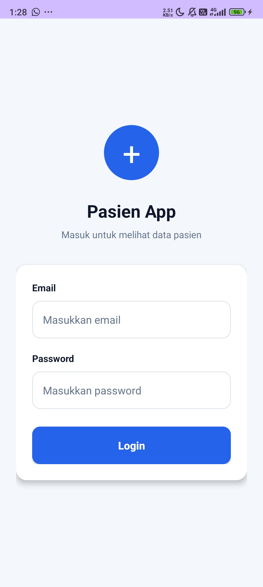
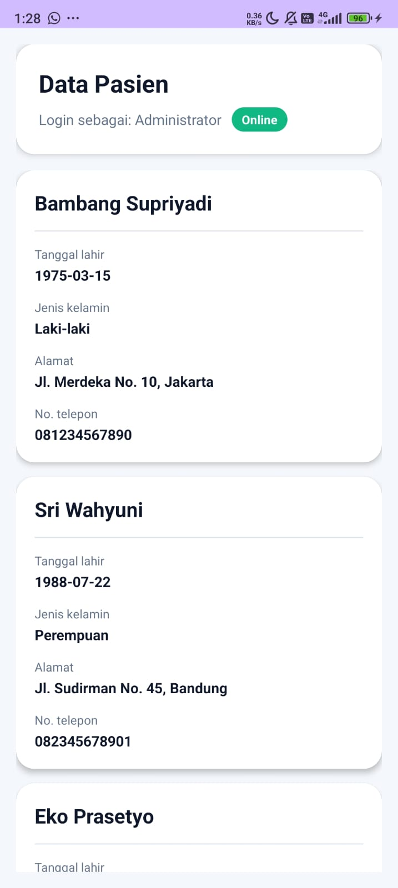

# PasienApiApp

PasienApiApp adalah aplikasi Android berbasis Kotlin yang memiliki fitur login menggunakan API dan menampilkan daftar data pasien menggunakan RecyclerView. Aplikasi ini dibuat untuk memenuhi Tugas 5 mata kuliah Pemrograman Bergerak.

## Identitas

| Keterangan | Data |
|---|---|
| Nama | Muhammad Alfath Mavianza |
| NIM | F1D02310077 |
| Kelas | A |
| Mata Kuliah | Pemrograman Bergerak |
| Tugas | Tugas 5 - Login API dan Data Pasien |

## Fitur Aplikasi

- Login menggunakan API dengan email dan password.
- Validasi input email dan password agar tidak kosong.
- Menampilkan loading saat proses login dan pengambilan data berjalan.
- Menyimpan token dari response login.
- Mengirim token sebagai header `Authorization: Bearer {token}` saat mengambil data pasien.
- Menampilkan nama user yang berhasil login.
- Mengambil data pasien dari endpoint API.
- Menampilkan data pasien menggunakan RecyclerView.
- Menampilkan informasi pasien berupa nama, tanggal lahir, jenis kelamin, alamat, dan nomor telepon.
- Menggunakan desain UI modern bertema medical app.

## Teknologi yang Digunakan

- Kotlin
- XML Layout
- Retrofit
- Gson Converter
- OkHttp Logging Interceptor
- RecyclerView
- SharedPreferences
- Android Studio

## Endpoint API

| Fitur | Method | Endpoint | Keterangan |
|---|---|---|---|
| Login | POST | `https://api.pahrul.my.id/api/login` | Mengirim email dan password untuk mendapatkan token |
| Data Pasien | GET | `https://api.pahrul.my.id/api/pasien` | Mengambil daftar pasien menggunakan Bearer token |

## Alur Aplikasi

1. User membuka halaman login.
2. User mengisi email dan password.
3. Aplikasi mengirim request login ke endpoint `/api/login`.
4. Jika login berhasil, aplikasi mengambil token dari `data.token`.
5. Token disimpan menggunakan SharedPreferences.
6. Aplikasi berpindah ke halaman data pasien.
7. Aplikasi mengambil data pasien dari endpoint `/api/pasien`.
8. Token dikirim melalui header `Authorization: Bearer {token}`.
9. Data pasien ditampilkan dalam RecyclerView.

## Struktur Project

```text
com.example.pasienapiapp
├── MainActivity.kt
├── PatientActivity.kt
├── adapter
│   └── PasienAdapter.kt
├── model
│   ├── ApiResponse.kt
│   ├── LoginRequest.kt
│   ├── LoginResponse.kt
│   ├── Pasien.kt
│   └── User.kt
└── network
    ├── ApiService.kt
    └── RetrofitClient.kt
```

## Model Data

### LoginRequest

Digunakan untuk mengirim email dan password ke endpoint login.

```kotlin
data class LoginRequest(
    val email: String,
    val password: String
)
```

### LoginResponse

Digunakan untuk membaca response login, termasuk token dan data user.

```kotlin
data class LoginResponse(
    val success: Boolean,
    val message: String,
    val data: LoginData?
)

data class LoginData(
    val token: String,
    val user: User
)
```

### Pasien

Digunakan untuk memetakan data pasien dari API.

```kotlin
data class Pasien(
    val id: Int,
    val nama: String,
    val tanggal_lahir: String,
    val jenis_kelamin: String,
    val alamat: String,
    val no_telepon: String,
    val created_at: String?,
    val updated_at: String?
)
```

## Implementasi Token

Token didapatkan dari response login pada field:

```kotlin
response.body()?.data?.token
```

Token kemudian disimpan menggunakan SharedPreferences:

```kotlin
prefs.edit()
    .putString("token", token)
    .putString("name", userName)
    .apply()
```

Saat mengambil data pasien, token dikirim sebagai Bearer token:

```kotlin
val bearerToken = "Bearer $token"
val response = RetrofitClient.apiService.getPasien(bearerToken)
```

## Screenshot Aplikasi

Simpan screenshot aplikasi di folder:

```text
screenshots/
```

Gunakan nama file seperti berikut:

```text
screenshots/login.png
screenshots/data_pasien.png
```

### Halaman Login



### Halaman Data Pasien



## Cara Menjalankan Aplikasi

1. Clone repository ini.

```bash
git clone https://github.com/Mavianza/PasienApiApp.git
```

2. Buka project menggunakan Android Studio.

3. Tunggu proses Gradle Sync selesai.

4. Jalankan aplikasi pada emulator atau perangkat Android.

5. Login menggunakan akun yang tersedia dari API.

6. Setelah login berhasil, aplikasi akan menampilkan daftar data pasien.

## Repository

Repository GitHub:

```text
https://github.com/Mavianza/PasienApiApp
```

## Kesimpulan

Aplikasi PasienApiApp berhasil mengimplementasikan login menggunakan API, penyimpanan token, penggunaan Bearer token untuk endpoint yang membutuhkan autentikasi, serta menampilkan data pasien menggunakan RecyclerView. Aplikasi ini juga menggunakan struktur kode yang modular dan desain UI yang rapi berbasis XML layout.
